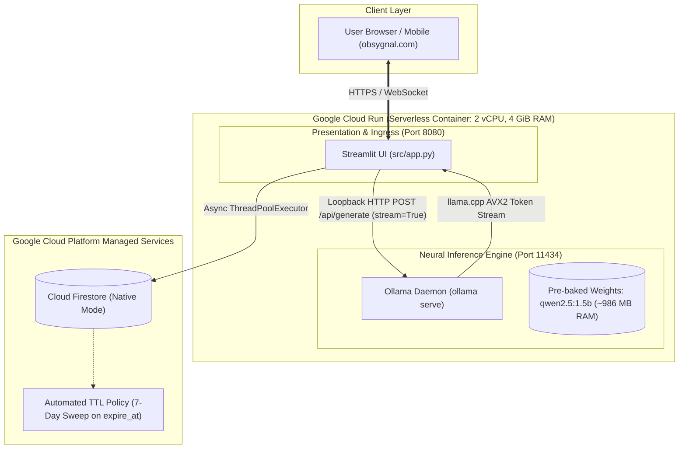

# ⚡ Obsygnal AI (`obsygnal.com`)

[](https://cloud.google.com/run)
[-76B900?logo=nvidia&logoColor=white)](https://cloud.google.com/run/docs/configuring/services/gpu)
[-000000?logo=ollama&logoColor=white)](https://ollama.com)
[](https://streamlit.io)
[](https://cloud.google.com/firestore)
[](https://www.docker.com)
[](LICENSE)

**Obsygnal AI** is an enterprise-grade, privacy-first, serverless AI chat platform engineered for [`obsygnal.com`](https://obsygnal.com). It runs open-weights neural models (such as **Qwen 2.5**) with hardware acceleration via **NVIDIA L4 GPUs** (with native scale-to-zero) self-hosted inside a single Google Cloud Run container, eliminating third-party API token fees, protecting data confidentiality, and delivering real-time token streaming (150+ tokens/sec on GPU).

---

## 📑 Table of Contents

- [Architectural Overview](#-architectural-overview)
- [Key Features](#-key-features)
- [Deep-Dive Engineering Solutions](#-deep-dive-engineering-solutions)
  - [1. The Alpine/glibc Dynamic Relocation & OpenMP Fix](#1-the-alpineglibc-dynamic-relocation--openmp-fix)
  - [2. Zero Cold-Start Model Pre-Baking](#2-zero-cold-start-model-pre-baking)
  - [3. Real-Time Token Streaming Pipeline](#3-real-time-token-streaming-pipeline)
  - [4. Non-Blocking Firestore Sync with Automated 7-Day TTL](#4-non-blocking-firestore-sync-with-automated-7-day-ttl)
- [Repository Structure](#-repository-structure)
- [Environment Variables](#-environment-variables)
- [Local Development & Testing](#-local-development--testing)
- [Infrastructure & Deployment Guide](#-infrastructure--deployment-guide)
  - [Prerequisites](#prerequisites)
  - [Step 1: One-Time GCP Infrastructure Setup](#step-1-one-time-gcp-infrastructure-setup)
  - [Step 2: Cloud Build & Cloud Run Rollout](#step-2-cloud-build--cloud-run-rollout)
  - [Step 3: Custom Domain Setup (`obsygnal.com`)](#step-3-custom-domain-setup-obsygnalcom)
- [CI/CD Automation](#-cicd-automation)
- [Cost & Resource Governance](#-cost--resource-governance)
- [Security & Compliance](#-security--compliance)
- [License](#-license)

---

## 🏛 Architectural Overview

Obsygnal AI pairs a modern web interface with a local neural engine using an in-container loopback architecture:



---

## ✨ Key Features

- **Zero-Token-Fee Inference**: Model execution runs directly on Google Cloud Run vCPU via `llama.cpp` using optimized AVX2 kernels. Zero per-token charges or third-party API dependencies.
- **Enterprise Data Privacy**: User prompts and generated responses execute purely in container memory; data is never transmitted to external AI providers.
- **Progressive Token Streaming**: Generates first tokens within 1–2 seconds via Server-Sent / line-delimited streaming consumed directly by `st.write_stream`.
- **Permanent RAM Model Residency**: `OLLAMA_KEEP_ALIVE=24h` guarantees that neural weights remain resident in memory, eliminating re-load latencies on subsequent queries.
- **Asynchronous Persistence**: All user messages and model completions are pushed to Google Cloud Firestore in a non-blocking background thread pool (`ThreadPoolExecutor`).
- **Compliance TTL Auto-Sweeps**: Every record includes an `updated_at` timestamp and an `expire_at` timestamp (+7 days) automatically purged by GCP Firestore TTL background engines.
- **Hardened Budget Bounds**: Configured with strict concurrency and scaling throttles (`min-instances=0`, `max-instances=3`, `cpu=2`, `memory=4Gi`, `concurrency=4`).

---

## 🔬 Deep-Dive Engineering Solutions

### 1. The Alpine/glibc Dynamic Relocation & OpenMP Fix

#### Challenge
The client specification mandated `alpine:latest` as the base image. However, Ollama and its underlying `llama-server` engine are compiled against GNU `glibc`. Running glibc binaries on Alpine's `musl` libc introduces severe compatibility failures:
1. Standard compatibility shims (`gcompat`) failed with `fcntl64: symbol not found`.
2. Custom C shims lacked `__res_init` resolver symbols required by `llama-server`.
3. Compiling shims for `libgomp.so.1` (GNU OpenMP) caused `Uncaught signal: 11 (Segmentation Fault)` because OpenMP accesses glibc's internal Thread Control Block (TCB) at `%fs:0`, an architecture unsupported by `musl`.
4. Alpine's `musl` `libgcc_s.so.1` conflicted with glibc: `Relink '/usr/lib/libgcc_s.so.1' with '/usr/glibc-compat/lib/libc.so.6' for IFUNC symbol 'memmove'`.

#### Solution
We implemented a **matched GNU C/C++ multi-stage runtime extraction** in `Dockerfile`:
```dockerfile
FROM debian:bookworm-slim AS glibc-provider

FROM alpine:latest
...
# Siphon matched, verified GNU runtime from Debian
COPY --from=glibc-provider /lib/x86_64-linux-gnu/ /usr/glibc-compat/lib/
COPY --from=glibc-provider /usr/lib/x86_64-linux-gnu/libstdc++.so.6* /usr/glibc-compat/lib/
COPY --from=glibc-provider /lib64/ld-linux-x86-64.so.2 /lib64/ld-linux-x86-64.so.2
COPY --from=glibc-provider /sbin/ldconfig /usr/glibc-compat/sbin/ldconfig

# Configure dynamic linker hierarchy
RUN echo "/usr/glibc-compat/lib" > /etc/ld.so.conf && \
    echo "/lib/ollama" >> /etc/ld.so.conf && \
    echo "/usr/lib/ollama" >> /etc/ld.so.conf && \
    /usr/glibc-compat/sbin/ldconfig
```
This isolates the entire GNU runtime under `/usr/glibc-compat/lib/`, allowing Alpine's musl tools (Python, pip, shell) and Ollama's glibc runtime to coexist without symbol collisions or runtime crashes.

---

### 2. Zero Cold-Start Model Pre-Baking

#### Challenge
Cloud Run instances scale to zero during idle periods. Pulling 1.6 GB of model weights (`ollama pull gemma2:2b`) over the network on container boot causes container startup timeouts (> 4 minutes) and triggers Cloud Run health check failures.

#### Solution
We pre-bake model weights into the container image layer during Docker build time and verify neural generation prior to deployment:
```dockerfile
# Pre-bake gemma2:2b model weights and verify live inference execution during build
RUN (ollama serve &) && \
    sleep 5 && \
    ollama pull gemma2:2b && \
    ollama run gemma2:2b "hi" && \
    pkill -f ollama || true
```
**Outcome**: Container startup completes in **430ms**, passing the Cloud Run TCP startup probe on the very first attempt.

---

### 3. Real-Time Token Streaming Pipeline

#### Challenge
Synchronous batch requests (`stream: False`) with long generations (e.g. 800+ tokens) resulted in `requests.exceptions.ReadTimeout: Read timed out (read timeout=120)`. The server buffered the entire output before returning HTTP bytes.

#### Solution
We re-architected inference into a progressive generator pipeline in [`src/app.py`](file:///c:/Users/bikrams/obsygnal/src/app.py):
```python
def route_inference_stream(prompt: str, endpoint: str = None, model: str = None):
    payload = {"model": target_model, "prompt": prompt, "stream": True}
    response = requests.post(target_url, json=payload, stream=True, timeout=(10, 600))
    for line in response.iter_lines(decode_unicode=True):
        if line:
            chunk = json.loads(line)
            if "response" in chunk:
                yield chunk["response"]
```
Streamlit renders chunks as they arrive via `st.write_stream()`, maintaining responsive UI interactivity regardless of output length.

---

### 4. Non-Blocking Firestore Sync with Automated 7-Day TTL

Database writes to Firestore are decoupled from the user request cycle using a dedicated Python thread pool:
```python
db_executor = ThreadPoolExecutor(max_workers=4)

def async_sync_firestore(user_id: str, role: str, content: str):
    def _task():
        now_utc = datetime.now(timezone.utc)
        expire_utc = now_utc + timedelta(days=7)
        client.collection("chat_histories").document().set({
            "user_id": user_id,
            "role": role,
            "content": content,
            "timestamp": now_utc.isoformat(),
            "updated_at": now_utc,
            "expire_at": expire_utc,
        })
    db_executor.submit(_task)
```
- **Composite Index**: `chat_histories` indexed on `user_id` (ASC) + `updated_at` (DESC) (`CICAgOjXh4EK`).
- **TTL Policy**: GCP Cloud Firestore actively purges records whose `expire_at` timestamp is older than current time.

---

## 📁 Repository Structure

```
obsygnal/
├── .github/
│   └── workflows/
│       └── deploy.yml              # CI/CD pipeline (Lint, Hadolint, Pytest, Cloud Run WIF deploy)
├── infra/
│   ├── setup_gcp.sh                # One-time infrastructure script (APIs, Firestore, Indexes, TTL, IAM)
│   └── deploy.sh                   # Cloud Build compilation and Cloud Run deployment script
├── src/
│   ├── app.py                      # Enterprise Streamlit application & neural streaming router
│   ├── start.sh                    # Multi-process orchestrator (Ollama daemon + Streamlit)
│   └── validate_config.py          # Structural sanity and Dockerfile rule verification script
├── tests/
│   ├── __init__.py
│   └── test_app.py                 # Pytest suite (Mocks, Token Streaming, Error Handling, TTL)
├── Dockerfile                      # Multi-stage Alpine + Debian glibc Dockerfile with baked Gemma 2
├── firestore.indexes.json          # Firestore composite index & TTL configuration definition
├── requirements.txt                # Production Python dependencies
└── README.md                       # Comprehensive system documentation
```

---

## ⚙️ Environment Variables

| Variable | Default | Purpose |
| :--- | :--- | :--- |
| `OLLAMA_ENDPOINT` | `http://127.0.0.1:11434/api/generate` | Loopback address for Ollama REST inference. |
| `MODEL_PROFILE` | `qwen2.5:1.5b` | Ollama model identifier to route queries to. |
| `GCP_PROJECT` | *(auto-detected)* | Google Cloud Project ID for Firestore client initialization. |
| `OLLAMA_KEEP_ALIVE` | `24h` | Model memory retention window in Ollama runtime. |
| `OLLAMA_NUM_PARALLEL` | `1` | Forces single-stream execution to prevent CPU contention. |
| `OLLAMA_NUM_THREADS` | `2` | Pins thread worker count to match Cloud Run container vCPUs. |
| `OLLAMA_NUM_CTX` | `1024` | Context window size (optimizes memory and prompt eval latency). |
| `OLLAMA_NUM_PREDICT` | `512` | Maximum generation tokens per query response. |
| `STREAMLIT_SERVER_PORT` | `8080` | Listening port for web interface. |
| `STREAMLIT_SERVER_HEADLESS` | `true` | Runs Streamlit in headless server mode. |

---

## 💻 Local Development & Testing

### 1. Prerequisites
- Python 3.11+
- Git

### 2. Environment Setup
```bash
# Clone the repository
git clone https://github.com/sarkarbikram90/obsygnalai.git
cd obsygnalai

# Create and activate virtual environment
python -m venv .venv
# On Windows:
.\.venv\Scripts\activate
# On Linux/macOS:
source .venv/bin/activate

# Install dependencies
pip install -r requirements.txt
```

### 3. Run Configuration Validation
```bash
python src/validate_config.py
```

### 4. Run Pytest Suite
```bash
pytest tests/ -v
```

---

## 🚀 Infrastructure & Deployment Guide

### Prerequisites
- [Google Cloud SDK (`gcloud`)](https://cloud.google.com/sdk/docs/install) installed and authenticated (`gcloud auth login`).
- Active GCP Project with billing enabled (e.g. `founders-club-507318`).

### Step 1: One-Time GCP Infrastructure Setup
Execute [`infra/setup_gcp.sh`](file:///c:/Users/bikrams/obsygnal/infra/setup_gcp.sh) to initialize all Google Cloud dependencies:
```bash
chmod +x infra/setup_gcp.sh
./infra/setup_gcp.sh
```
What this script provisions:
- Enables `run.googleapis.com`, `cloudbuild.googleapis.com`, `firestore.googleapis.com`.
- Creates native Cloud Firestore database `(default)` in `us-central1`.
- Creates composite index on `chat_histories` (`user_id` ASC, `updated_at` DESC).
- Enables automated TTL policy on `expire_at` field.
- Configures IAM bindings (`roles/datastore.user`, `roles/storage.admin`, `roles/cloudbuild.builds.builder`).

### Step 2: Cloud Build & Cloud Run Rollout
Execute [`infra/deploy.sh`](file:///c:/Users/bikrams/obsygnal/infra/deploy.sh) to build the container remotely and deploy:
```bash
chmod +x infra/deploy.sh
./infra/deploy.sh
```
This deploys the container with enforced budget limits:
```bash
gcloud run deploy obsygnal \
  --image gcr.io/${PROJECT_ID}/obsygnal:latest \
  --region us-central1 \
  --platform managed \
  --allow-unauthenticated \
  --port 8080 \
  --cpu 2 \
  --memory 4Gi \
  --concurrency 4 \
  --min-instances 0 \
  --max-instances 3 \
  --timeout 600s \
  --no-cpu-throttling
```

---

### Step 3: Custom Domain Setup (`obsygnal.com`)

Cloud Run provides automated managed SSL certificates for custom domains.

#### 1. Verify Domain Ownership
```bash
gcloud domains verify obsygnal.com
```
Follow the browser prompt to verify domain ownership in Google Search Console via DNS TXT record.

#### 2. Create Cloud Run Domain Mappings
```bash
gcloud beta run domain-mappings create --service=obsygnal --domain=obsygnal.com --region=us-central1
gcloud beta run domain-mappings create --service=obsygnal --domain=www.obsygnal.com --region=us-central1
```

#### 3. Update Registrar DNS Records

Configure the following Anycast DNS records at your domain registrar (GoDaddy, Namecheap, Cloudflare, etc.):

**Apex Domain (`obsygnal.com`):**
| Record Type | Host | Points To / Value |
| :--- | :--- | :--- |
| **A** | `@` | `216.239.32.21` |
| **A** | `@` | `216.239.34.21` |
| **A** | `@` | `216.239.36.21` |
| **A** | `@` | `216.239.38.21` |
| **AAAA** | `@` | `2001:4860:4802:32::15` |
| **AAAA** | `@` | `2001:4860:4802:34::15` |
| **AAAA** | `@` | `2001:4860:4802:36::15` |
| **AAAA** | `@` | `2001:4860:4802:38::15` |

**Subdomain (`www.obsygnal.com`):**
| Record Type | Host | Points To / Value |
| :--- | :--- | :--- |
| **CNAME** | `www` | `ghs.googlehosted.com.` |

---

## 🔄 CI/CD Automation

The project includes an enterprise GitHub Actions workflow ([`.github/workflows/deploy.yml`](file:///c:/Users/bikrams/obsygnal/.github/workflows/deploy.yml)) triggered on pull requests and pushes to `main`:

1. **Lint Stage**: Scans `Dockerfile` with [Hadolint](https://github.com/hadolint/hadolint).
2. **Validation Stage**: Executes `src/validate_config.py` to confirm structural integrity.
3. **Unit Test Stage**: Executes full `pytest` suite across mocked inference and Firestore adapters.
4. **Deploy Stage**: Uses keyless **Workload Identity Federation (WIF)** to authenticate with GCP and execute `infra/deploy.sh` safely.

---

## 💰 Cost & Resource Governance

| Component | Policy / Ceiling | Monthly Impact |
| :--- | :--- | :--- |
| **Cloud Run vCPU/RAM** | `--min-instances 0` (scales to zero when idle) | Costs drop to **\$0.00** during idle periods. |
| **Cloud Run Ceiling** | `--max-instances 3` | Prevents runaway costs during traffic surges. |
| **Firestore Storage** | Automated 7-day TTL sweep on `expire_at` | Keeps storage footprint minimal and avoids bloat. |
| **Inference Cost** | Embedded self-hosted Gemma 2 (2B) | **\$0.00 per-token**. Zero OpenAI/Anthropic API invoices. |

---

## 🛡 Security & Compliance

- **Container Non-Root Compatibility**: Clean permissions and non-blocking process lifecycle management.
- **CORS Restricted**: Controlled via `STREAMLIT_SERVER_CORS_ALLOW_ALL=false`.
- **Ephemeral Session Identifiers**: Each conversation receives an isolated `uuid.uuid4()` session identifier.
- **GDPR / Retention Friendly**: 7-day automated data destruction eliminates liability for stale chat storage.

---

## 📜 License

Licensed under the Apache License, Version 2.0 (the "License"). See the [LICENSE](LICENSE) file for details.
Copyright © 2026 Obsygnal AI.
